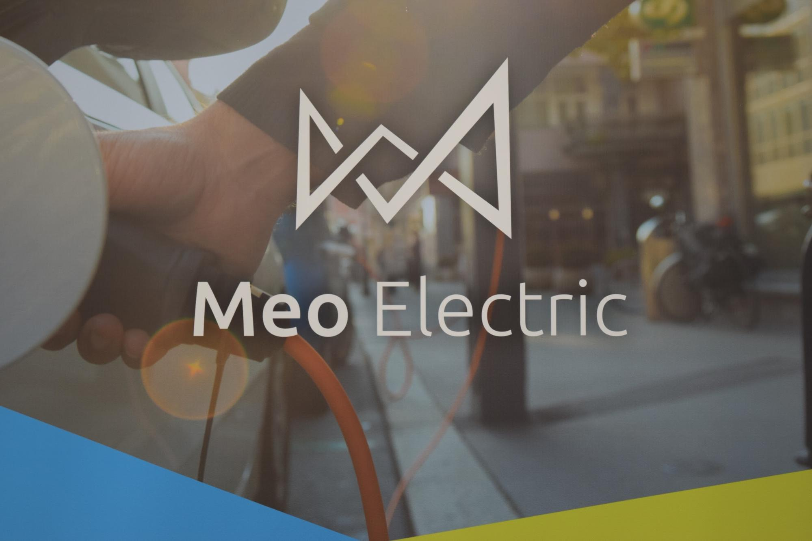

The Québec government openly pushes for an increase of electric vehicles on the road and provides many incentives for the population to help them in reaching their goal of 100,000 EVs by 2020. Not only are carpool lanes open to those driving EVs on the highway, but those driving EVs are also exempt from paying tolls on the road. As of March 2016, 9,211 electric vehicles have been registered in Québec which makes it the province with the most EVs in Canada. Ontario comes in behind with 6,506 and British Columbia next with 3,682 registered EVs.

If you’re looking to purchase or lease a so-called “green car” in Québec anytime soon, you will be eligible for a rebate from the government. While the largest rebate stands at $8,000, it only applies to vehicles that are all-electric and plug-in hybrids with a big enough battery capacity. If electric motorcycles are more your poison/type/fancy, the government is offering a $2,000 rebate, though it has to be completely powered by electricity. The official list of eligible vehicles and the specific amount of rebate that is offered for each vehicle is available on the government’s website here.

Upon purchasing or even before purchasing your electric vehicle, installing a charging station may be something you should think about as well. The government is offering a rebate of up to $600 for the purchase and installation of a new 240V EV charging station in your home. Further details on the government’s charging station rebate can be found here. Businesses and organizations are also eligible for financial assistance if they wish to install charging stations for their employees as well. Specific details can be found here.

Electric vehicle charging station installation is where we come in. Meo Electric provides both individuals and businesses with an easy charging solution. Rather than having to go to the supplier yourself, then going through the hassle of hiring an electrician, we offer a personalized and all-inclusive alternative. We work directly with the supplier and electrician to provide you with the optimal charging station suited specifically to your car’s needs. Not only do we aid with incentive programs, we provide ongoing monitoring and support as well. Even more, we’re based in Montréal and use Québec-made charging stations, so you’ll be supporting the local Canadian economy!

Thinking of purchasing a Tesla? The city of Montréal is more than accommodating to owners of this EV. Montréal’s Tesla service and sales centre, located on Ferrier next to the famous Gibeau Orange Julep, is the largest in North America. Québec also has 3 Tesla supercharger locations, one located in Montréal at the Ferrier store with 2 chargers, one in Magog with 8 chargers, and one in Drummondville with 8 chargers. If you’re worried that 2 supercharger locations isn’t enough, at Montréal’s Place Vertu parking lot, a new 12-stall supercharger station is already under construction. In addition, Tesla’s can plug into any charging station, as the car comes with an adapter for this exact purpose and there are a multitude of charging stations in Québec.

With government incentives and a wide availability of charging stations, Québec is an ideal province to be an electric vehicle owner in.