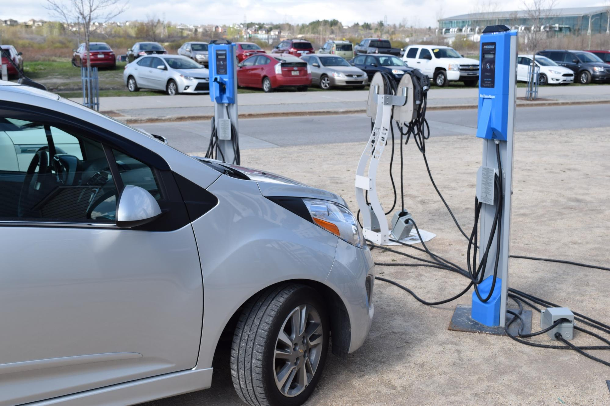
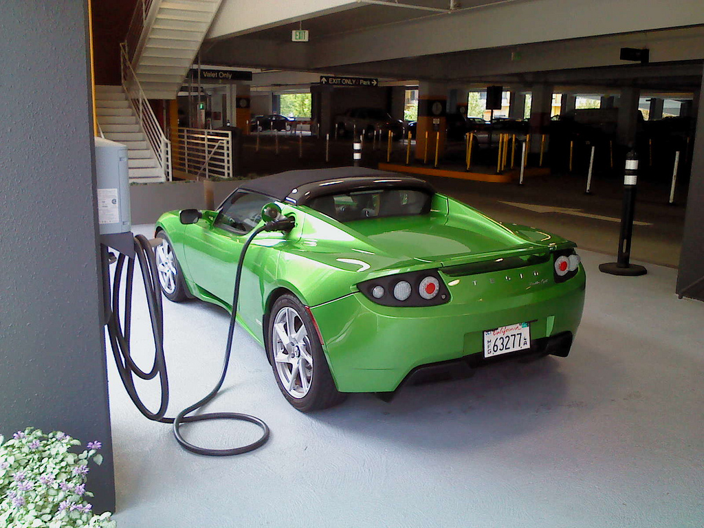

The Québec government openly pushes for an increase of electric vehicles on the road and provides many incentives for the population to help them in reaching their goal of 100 000 EVs by 2020. Not only are carpool lanes open to those driving EVs on the highway, but those driving EVs are also exempt from paying tolls on the road. As of March 2016, 9211 electric vehicles have been registered in Québec which makes it the province with the most EVs in Canada. Ontario comes in behind with 6506 and British Columbia next with 3682 registered EVs.

If you’re looking to purchase or lease a “green car” in Québec anytime soon, you will be eligible for a rebate from the government. While the largest rebate stands at $8000, it only applies to vehicles that are all-electric and plug-in hybrids with a big enough battery capacity. If electric motorcycles are more your style, the government is offering a $2000 rebate, though it has to be completely powered by electricity.

Quebec keeps you recharged, too. The government is offering a rebate of up to $600 for the purchase and installation of a new 240V EV charging station in your home. Businesses and organisations are also eligible for financial assistance if they wish to install charging stations for their employees as well.

In addition, individuals and businesses looking to purchase and install a charger can take advantage of Meo Electric's turnkey service. Rather than having to work separately with the supplier and an electrician, customers in Montreal and Ottawa/Gatineau receive an all-in-one solution, including charger purchase, installation, aid with incentive programs, and ongoing monitoring and support.

Thinking of purchasing a Tesla? The city of Montréal is more than accommodating for owners of this EV. Montréal’s Tesla service and sales centre is the largest in North America, and Québec boasts 3 Tesla supercharger locations, one located in Montréal with 2 chargers, one in Magog with 8 chargers, and one in Drummondville with 8 chargers. Plus, a new 12-stall supercharger station at Montréal’s Place Vertu is already under construction.

With government incentives and a wide availability of charging stations, Québec is an ideal province for electric vehicle owners, allowing the province to continue leading the charge of transport electrification in Canada.