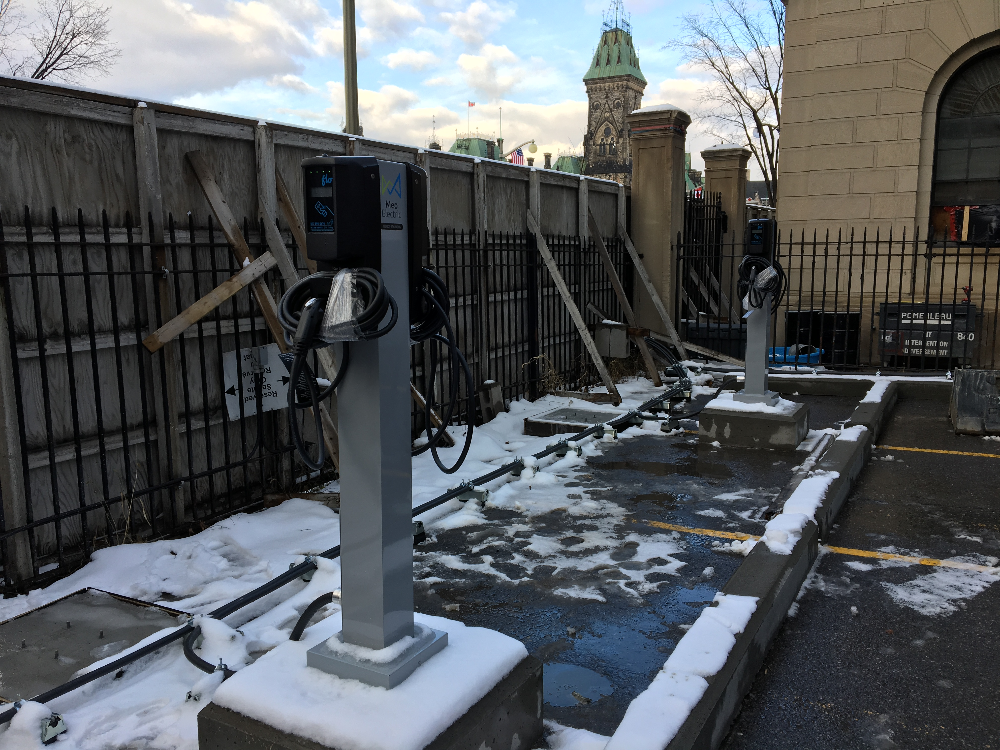
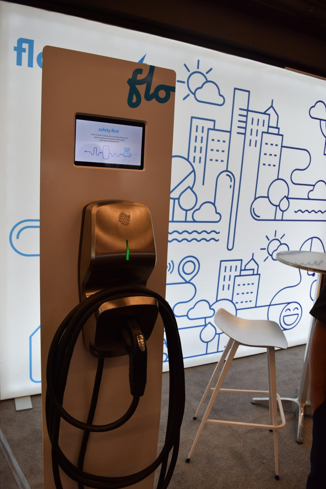
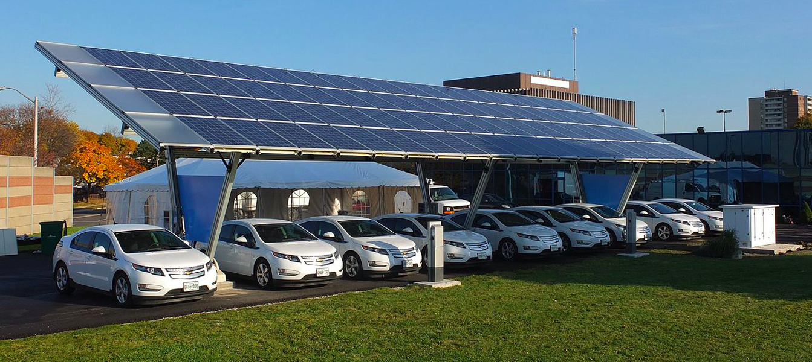
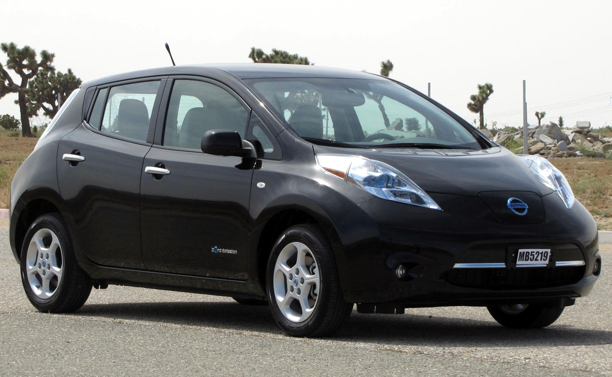
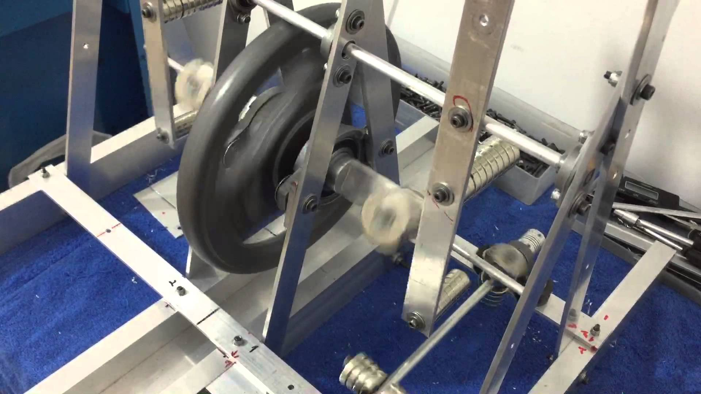
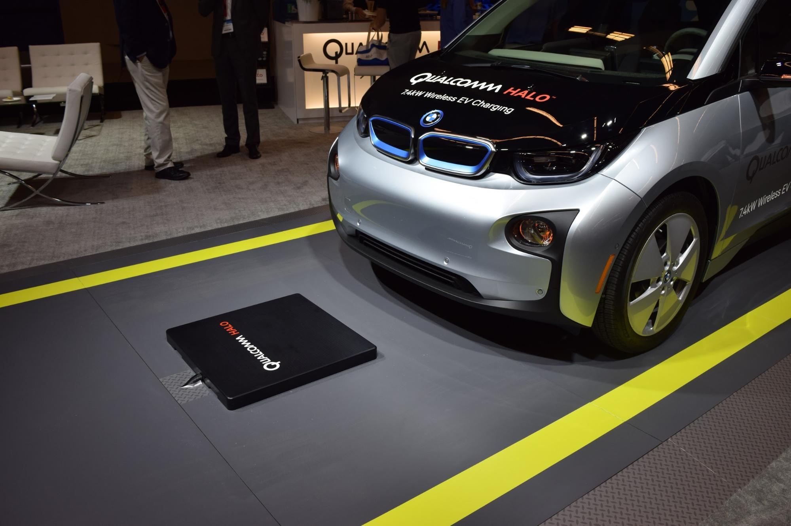

The 29th Electric Vehicle Symposium (EVS), the world’s largest international electric vehicle conference, was held in Montréal from June 19-22. It saw global technological, academic, and government leaders come together to discuss market and policy topics and showcased the latest innovations and technologies in vehicle electrification. Here’s are just a few of the week's highlights:

## Fast-charging in Quebec

Québec’s Premier Philippe Couillard reinforced the government’s dedication to electrify the province by announcing government plans to install 6 EV fast-charging stations along Highway 20 between Montreal and Québec that would be completed within the next 6 months.

While the government of Québec already provides rebates for those buying electric vehicles or installing charging stations in their homes, the implementation of additional charging stations along the highway provides even greater incentive for those who are thinking of purchasing an EV. Increased availability of charging stations will continue to reduce Quebecers' range anxiety, an issue that many EV owners have to worry about when making long-distance trips.

## FLO Network and a smart home charger

AddÉnergie unveiled their FLO Network (a reimagining of the VER Network) and released an EV home charging station designed to withstand the Canadian winter. It will be available in Fall 2016 for around $1,195 and is eligible for the government’s charging station rebates for purchasing and installation of the station. FLO Home™ is entirely made in Québec, perfect for those who enjoy supporting the local Canadian economy.

## Telematics for partial-electric fleets

FleetCarma, a connected platform for electric vehicle owners, debuted a cutting-edge telematics device for fleets wishing to increase their total number of EVs in operation. Dubbed “C2,” the device is the first of its kind that is able to support diesel, hybrid, gasoline and electric vehicles. Data from C2 can indicate which vehicles in the fleet are best to be replaced with EVs while connecting these new electric vehicles into the same telematics system as the rest of the fleet.

## BMW battery storage

BMW introduced a new home energy storage system that can be operated by either new or old BMW i3 batteries. It can be integrated with both solar panels and charging stations, extending battery life beyond vehicle usage for ultimate sustainability. This presents an alternative solution to simply recycling or throwing out your old car battery; It could be hanging on your wall providing power instead.

## A bigger Leaf battery

Kazuo Yajima, the global director of electric vehicles and hybrid-electric vehicle engineering for Nissan, confirmed that the next-generation Nissan Leaf will have a larger battery pack with a 60-kWh capacity. This would allow the car to have a range around 200 miles in comparison to 107 miles with the current model’s 30-kWh battery.

## Wireless motors

In a panel presentation, graduate student Takehiro Imura of the University of Tokyo presented his work on a wireless in-wheel motor. The motors use magnetic coils to transmit power through air as opposed to cables and can circulate power across 20cm, transmitting power with around 95% efficiency, according to his research.

## Wireless charging with Halo

Also showcased at the symposium was Qualcomm’s wireless EV charging system, powered by magnetics. With a base pad, vehicle pad and controller unit, Qualcomm’s charging system, named, “Halo,” has four different power options from 3.4kW to 22kW. A pad is installed underneath the vehicle so that it lines up with the base pad when parked overtop for the most effective charge; An app that comes with the system assists the driver in determining the optimal positioning.

