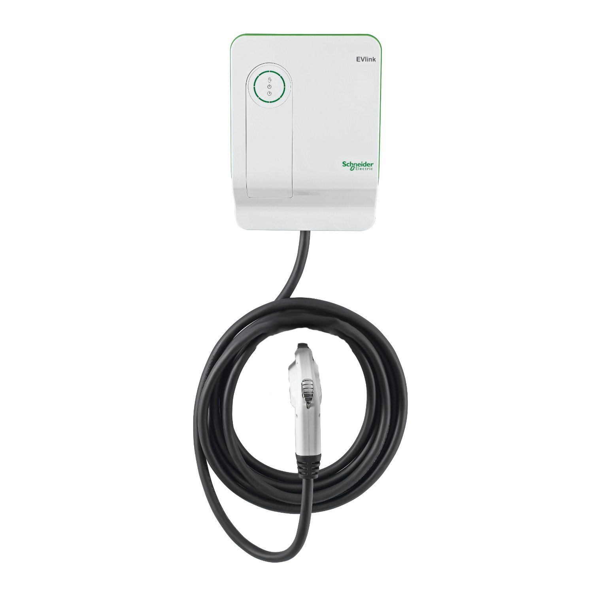

_Own a business? See the best Level 2 EV Chargers for businesses here (link)_

Level 2 home chargers typically use a 240V outlet, which can be installed in homes for a couple of hundred dollars. These chargers usually fully charge an electric car in around 3-5 hours, if the household outlet is 240V. Different chargers vary in their amperages, or charging capabilities, so a 30A charger will charge slower than a 40A. Depending on the EV you own, the charging stations capabilities may not utilize all of the power that the station delivers; this is common in plug-in hybrid EVs.

## Level 2 Charger Cost
Level 2 charging stations come in a range of prices, depending on a number of different factors. Different amperage, cord length, design, country of production, and smart technology compatibility can all affect this range.

Depending on where you live, you may want to consider your government’s rebates for level 2 charging stations as well. Quebec offers up to $600 for purchase and installation, while Ontario offers up to $1,000.

## Level 2 Charger Installation

## 1. [30A FLO Home Charger](https://flo.ca/at-home/single-family), $995

{: .half}

#### Pros:

* Smart charging capabilities, access info through their app
* Made in Canada
* Stylish design
* Uses standard SAE J1772MC connector
* 3 year warranty
* 25 ft cable

#### Cons:

* Pricier than other home chargers
{: .half}

{: .clear}

Canadian EVSE company AddÉnergie recently [announced](http://blog.meoelectric.com/evs29/) their home charging solution, the Flo Home Charger. The residential model brings AddÉnergie’s smart charging technology to the home, allowing you to manage your energy usage and charging using the FLO Network. On top of this, it is designed to last at least 2x longer than the normal charging station.

## 2. Leviton  EVB40-PST Evr-Green 400 40A, $924 USD  [Link](http://www.leviton.com/OA_HTML/ProductDetail.jsp?partnumber=EVB40-P5T&section=58375&minisite=10251)

{: .half}

#### Pros:

* Easy to move, non-permanent installation
* Uses standard SAE J1772MC connector
* 3 Year warranty
* 25 ft cable

#### Cons:

* Pricey
* USA made, country of origin: Mexico
* Installation kit sold separately ($90 USD)
* No Smart charging capabilities
{: .half}

{: .clear}

This charging station offered by Leviton, a company that is recommended by at least four major automakers, offers a very quick charge due to it’s amperage level of 40. Canadians should take into account that this charging station is made in the United States and is priced in USD.

## 3. [Schneider Electric 30 Amp Indoor Electric Vehicle Charging Station](https://www.homedepot.ca/en/home/p.30-amp-indoor-electric-vehicle-charging-station-2nd-gen---enhanced-model.1000772478.html), $799

{: .half}

#### Pros:

* Delayed charging
* Stylish design
* Easy to install
* 18 month warranty
* 18 ft charging cable

#### Cons:

* US made
{: .half}

{: .clear}

Schneider’s 30A level 2 charger is highly reviewed by customers. It’s design is incredibly stylish and you can even personalize the charger by covering it with a skin. It also allows you to schedule when you want to charge your vehicle with it’s delayed charging feature.

## 4. [EVDuty-25 - 30A](http://evandmore.com/collections/frontpage/products/charging-station-240-evduty), $739

{: .half}

#### Pros:

* Portable
* Easy installation and maintenance
* Uses standard SAE J1772MC connector
* 3 year warranty
* Made in Canada, free shipping within canada
* 25 ft charging cable

####  Cons:

* No smart charging capabilities
{: .half}

{: .clear}

Coming in at a more affordable price point is the Canadian-made EVDuty 30A Level 2 charger. With this charger you have the option to make it portable or install it permanently. Canadians also get the benefit of free shipping with this charging station!

## 5. [ClipperCreek HCS-40 32A](https://store.clippercreek.com/hcs-40-hcs-40p-ev-charging-station), $565 US

{: .half}

#### Pros:

* 3 Year warranty
* Uses standard SAE J1772MC connector
* Low price
* 25 ft charging cable

#### Cons:

* Made in America
* No Smart Charging capabilities
{: .half}

{: .clear}

ClipperCreek’s charging station is highly recommended and can be easily installed indoors or outdoors. Canadians should take into account that this charging station is priced in USD.

## 6. [JuiceBox™ Pro 40 - Smart 40-Amp EVSE](https://emotorwerks.com/index.php/juicebox-ev-charging-stations/202-juicebox-pro-40-smart-40-amp-evse-with-24-foot-cable/category_pathway-23), $599

{: .half}

#### Pros:

* 3 Year warranty
* Portable option
* Smart Charging capabilities, accessible through smartphone app
* Uses standard SAE J1772MC connector
* 24 ft charging cable
* Low Price

#### Cons:

* USA made
* Less sleek design
{: .half}

{: .clear}

The cheapest level 2 charging station on our list is JuiceBox’s Pro 40. This charging station charges just as fast as Leviton’s but comes in at a way more affordable price. It offers charging scheduling, energy metering, and WiFi connectivity which are all accessible through their app. It also has the option to be made portable!

## Choosing a Level 2 Charger

Meo can help you choose the best EV charger for your home, based on your charging needs, budget, and home electrical setup. Plus, once we've found the perfect charger for you, Meo Electric is the only company that lets you buy and install any electric vehicle charger in one step!

Get a free consultation and quote today: meoelectric.com
