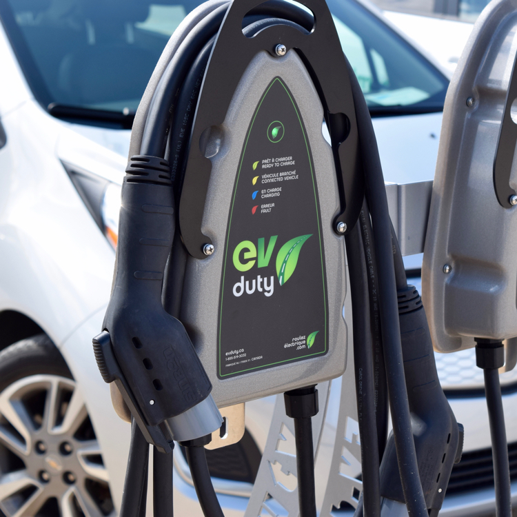
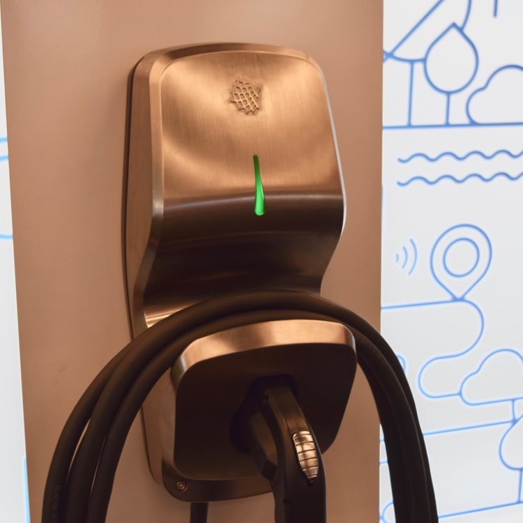
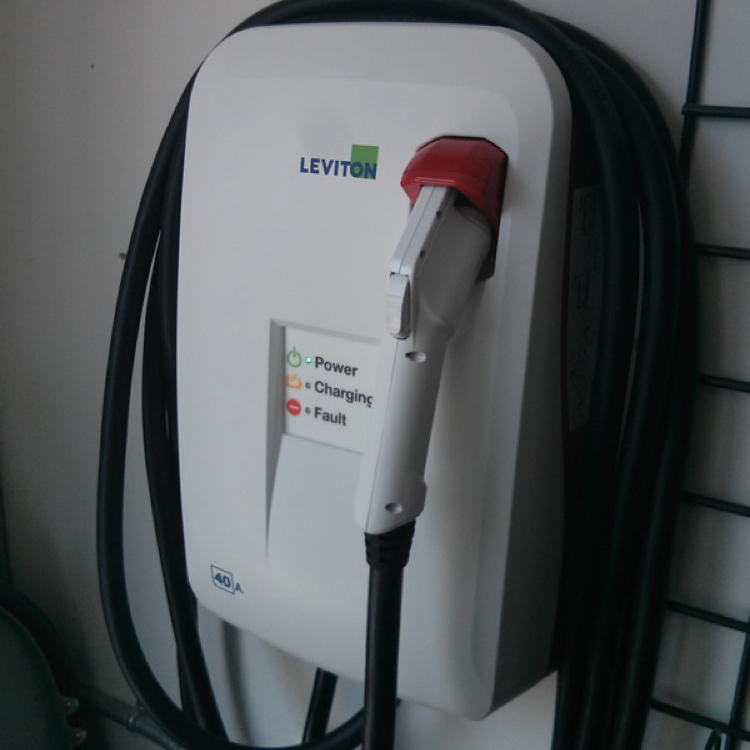
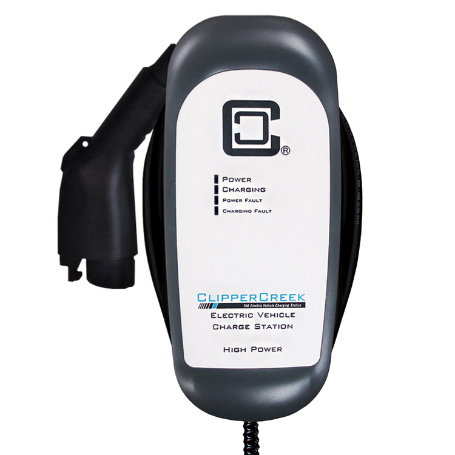
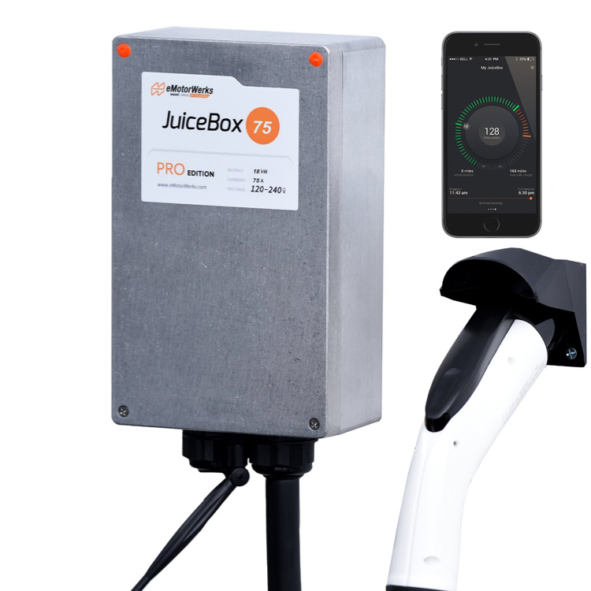

Level 2 chargers are a must-have for EV owners -- the higher-powered chargers cut charging time from 8-12 hours to just 3-5 hours, depending on the car. Plus, many level 2 chargers now include "smart" capabilities, including mobile app monitoring, delayed charging, and charging that responds to your home energy usage.

Level 2 home chargers typically use a 240V outlet, which can be installed in homes for a couple hundred dollars. Different chargers vary in their amperages, or charging capabilities, so a 30A charger will charge slower than a 40A.

## Level 2 Charger Cost
Level 2 charging stations come in a range of prices, depending on a number of different factors. Different amperage, cord length, design, country of production, and smart technology compatibility can all affect this range. Most chargers on the market range from $500 to $1000, with increasing features.

Depending on where you live, you may want to consider your government’s rebates for level 2 charging stations as well. Quebec offers up to $600 for purchase and installation, while Ontario offers up to $1000.

## Level 2 Charger Installation

Unlike level 1 chargers, which can be plugged into a 120V household outlet, level 2 chargers require a 240V outlet (similar to those used by washing machines and dryers). Depending on your household's electrical layout, installation of your level 2 charger will cost between $1000 and $2000. Installations must be done by a professional electrician, due to the high voltages involved. When choosing an electrician, be sure that they are familiar with EV chargers and the process of installation.

_Meo Electric's electricians are specialised in EV charger installations. [Get a free estimate for your project here.](http://meoelectric.com/estimate)_

## 1. [EVDuty-40 - 30A](http://evandmore.com/collections/frontpage/products/charging-station-240-evduty?variant=5051939267), $679

{: .half}

#### Pros:

* Portable
* Easy installation and maintenance
* 3 year warranty
* Made in Canada
* Free shipping within Canada
* Options for longer cables

####  Cons:

* No smart charging capabilities
{: .half}

{: .clear}

Coming in at a very affordable price point is the Canadian-made EVDuty 30A Level 2 charger. With this charger you have the option to make it portable or install it permanently. Canadians also get the benefit of free shipping with this charging station!

## 2. [30A FLO Home Charger](https://flo.ca/at-home/single-family), $1295

{: .half}

#### Pros:

* Smart charging capabilities, access info through their app
* Made in Canada
* Stylish design
* 3 year warranty
* 25 ft cable

#### Cons:

* Pricier than other home chargers
{: .half}

{: .clear}

Canadian EVSE company AddÉnergie recently [announced](http://blog.meoelectric.com/evs29/) their home charging solution, the Flo Home Charger. The residential model brings AddÉnergie’s smart charging technology to the home, allowing you to manage your energy usage and charging using the FLO Network. On top of this, it is designed to last at least 2x longer than the normal charging station.

## 3. [Leviton  EVB40-PST Evr-Green 400 32A](http://www.leviton.com/OA_HTML/ProductDetail.jsp?partnumber=EVB32-H18&section=37741&minisite=10251), $900

{: .half}

#### Pros:

* Easy to move, non-permanent installation
* 3 year warranty
* 25 ft cable

#### Cons:

* Pricey
* Installation kit sold separately ($90 USD)
* No smart charging capabilities
{: .half}

{: .clear}

This charging station offered by Leviton, a company that is recommended by at least four major automakers, offers a very quick charge due to it’s amperage level of 40. Canadians should take into account that this charging station is made in the United States and is priced in USD.

## 4. [Schneider Electric 30 Amp Indoor Electric Vehicle Charging Station](https://www.homedepot.ca/en/home/p.30-amp-indoor-electric-vehicle-charging-station-2nd-gen---enhanced-model.1000772478.html), $799

{: .half}

#### Pros:

* Delayed charging
* Stylish design
* Easy to install
* 18 month warranty
* 18 ft charging cable

#### Cons:

* Low amperage, causing slower charging
{: .half}

{: .clear}

Schneider’s 30A level 2 charger is highly reviewed by customers. It’s design is incredibly stylish and you can even personalize the charger by covering it with a skin. It also allows you to schedule when you want to charge your vehicle with it’s delayed charging feature.

## 5. [ClipperCreek HCS-40 32A](https://store.clippercreek.com/hcs-40-hcs-40p-ev-charging-station), $565 US

{: .half}

#### Pros:

* 3 Year warranty
* Low price
* 25 ft charging cable

#### Cons:

* No smart charging capabilities
{: .half}

{: .clear}

ClipperCreek’s charging station is highly recommended and can be easily installed indoors or outdoors. Canadians should take into account that this charging station is priced in USD.

## 6. [JuiceBox™ Pro 40 - Smart 40-Amp EVSE](https://emotorwerks.com/products/juicebox), $599 US

{: .half}

#### Pros:

* 3 year warranty
* Portable option
* Smart charging capabilities, accessible through smartphone app
* 24 ft charging cable
* Low Price

#### Cons:

* Less sleek design
{: .half}

{: .clear}

The cheapest level 2 charging station on our list is JuiceBox’s Pro 40. This charging station charges just as fast as Leviton’s but comes in at a way more affordable price. It offers charging scheduling, energy metering, and WiFi connectivity which are all accessible through their app. It also has the option to be made portable!

## Choosing a Level 2 Charger

Meo can help you choose the best EV charger for your home, based on your charging needs, budget, and home electrical setup. Plus, once we've found the perfect charger for you, Meo Electric is the only company that lets you buy and install any electric vehicle charger in one step!

[Get a free consultation and quote today.](http://meoelectric.com/estimate)
